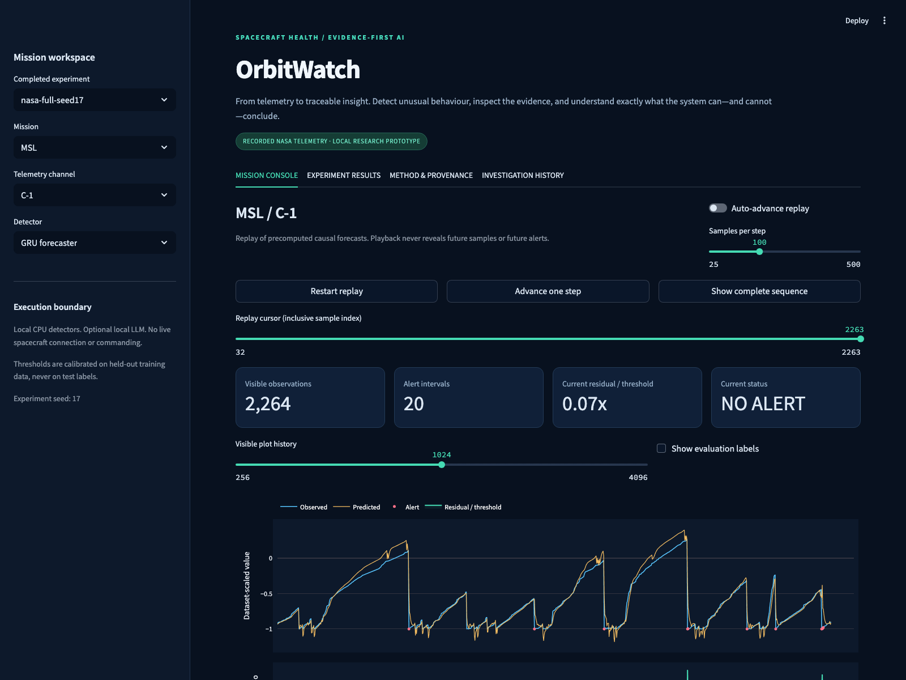

# OrbitWatch

### Evidence-grounded spacecraft telemetry investigation

A local research workbench that turns recorded NASA telemetry into **causal anomaly alerts,
inspectable evidence, real MCP tool calls, and cited investigation reports**.

**This is a working research prototype, not a live spacecraft control system.** It does not
claim state-of-the-art accuracy, physical root-cause diagnosis, or onboard flight qualification.

[Technical report](submission/Technical_Report.pdf) ·
[Presentation](submission/Final_Presentation.pptx) ·
[Measured detector results](submission/detection_metrics.csv) ·
[Explanation comparison](submission/explanation_summary.json)



## Recorded findings

Reference run: **`nasa-full-seed17`**, 81 unique channels, with a 32-case local explanation
pilot. These are actual measurements, not the historical report's illustrative headline scores.

| Detector | Macro point F1 | Macro average precision | Event recall | False-positive samples / 1,000 normal |
|---|---:|---:|---:|---:|
| Rolling median | 0.1582 | 0.2610 | 0.6442 | 45.16 |
| GRU | 0.2162 | 0.3175 | 0.8750 | 103.13 |

The GRU improved aggregate detection metrics **but produced substantially more false alarms**.
This is not operationally ready fault monitoring.

In the explanation pilot, **29 of 246 ordinary-model proposals failed the evidence checks**.
Validation removed those proposals; useful factual coverage and latency are reported separately.
The deterministic template achieved full factual coverage without LLM generation cost, an important
negative finding against assuming that an LLM always improves a structured reporting task.

## What is included

- A dark mission-console dashboard with recorded-data replay, forecasts, alert intervals,
  threshold ratios, evaluation overlays, and downloadable investigations.
- Two honestly named detectors: a rolling-median statistical baseline and a small GRU
  forecaster. Models operate separately on each NASA channel.
- Chronological fit/calibration separation, training-only fitted standardization, fixed
  thresholds, and test-label-independent inference.
- A real MCP stdio server and client, with discovery, structured evidence, and local audit logs.
- Deterministic reports and optional **entirely local** language-model claim generation.
- Validation of evidence citations, numeric values, sample indices, missing facts, duplicate
  claims, and the explicit unknown-cause boundary. No silent fallback to a different engine.
- Reproducible metrics, saved checkpoints, an explanation ablation, a generated technical
  report, and a presentation based on actual experiment artifacts.

```text
NASA SMAP / MSL channel files
           |
    chronological fitting + calibration
           |
 rolling-median / GRU causal forecasts
           |
  fixed residual threshold -> alert intervals
           |
       evidence packet
           |
      MCP server <-> MCP client
           |
 template / local LLM -> claim validation -> cited report
           |
 Streamlit dashboard + local SQLite history
```

## Quick start

Python **3.11 or 3.12** is required; the recorded environment uses Python 3.12.
Initial package, dataset, and optional model downloads require internet. Once installed,
the application and inference run locally without an API key.

```bash
git clone https://github.com/vikashmalakar275/M.Tech_Project.git
cd M.Tech_Project
python3.12 -m venv .venv
source .venv/bin/activate
python -m pip install -e '.[dev]'

# Download and validate the public NASA benchmark mirror (~86 MB compressed).
orbitwatch download

# A small first run: one channel from each mission.
orbitwatch train --channels A-1 C-1 --run-id quickstart

# Open http://127.0.0.1:8501
python -m streamlit run app.py
```

On the prepared Mac, double-click **`Launch.command`** or run `./Launch.command`.
The dashboard opens the most recently completed local experiment. If no experiment exists,
it shows the setup commands rather than invented demonstration results.

### Full detector experiment

```bash
source .venv/bin/activate
orbitwatch train --run-id nasa-full-seed17 --seed 17 --epochs 4
orbitwatch report --run nasa-full-seed17
```

Without `--channels`, every channel listed by the original NASA metadata is evaluated.
The 82 source rows represent **81 unique files** (54 SMAP, 27 MSL): duplicate `P-2`
annotations are combined by interval union and the file is evaluated once. This
predeclared reconciliation is recorded in the dataset manifest.
The run fails explicitly on missing/invalid data. A run ID cannot overwrite an existing run.
Interrupted runs are not selected by the dashboard; use a new ID for a fresh run.

Models, predictions, data, and local history are deliberately **not committed**. Download and
training commands reproduce them. `submission/` contains lightweight, measured outputs for
review without requiring a local training run.

## Optional local LLM

The deterministic engine is complete and available without an LLM. The local LLM is an
explicit second engine, not a requirement for detecting or investigating an alert.

Install [Ollama](https://ollama.com/) and start it, then:

```bash
ollama pull qwen2.5:3b
orbitwatch evaluate-explanations --run nasa-full-seed17 --cases 12
orbitwatch report --run nasa-full-seed17
```

The prepared Mac also has a project-local runtime under `.tools/ollama/` and model storage
under `.models/`. Start it with **`./Start_Local_LLM.command`** when it is not already running.
These downloaded third-party binaries and weights are not redistributed in Git.

Select **Evidence-validated local LLM** in the dashboard. Model/service errors are shown
explicitly; the app does not silently replace a failed LLM report with a template.

### What “evidence-grounded” means here

The LLM proposes a small structured set of facts. Only supported facts with the correct
evidence ID are accepted. Final prose comes from a trusted renderer, not arbitrary model
text. This deliberately trades expressiveness for an inspectable correctness boundary.

**Zero unsupported emitted facts within this restricted schema is not proof of general LLM
truthfulness.** The deterministic template has the same factual guarantee without LLM cost.
The experiment therefore reports factual coverage and latency as well as rejected claims.

The explanation comparison includes:

1. Deterministic template.
2. Ordinary local-model draft.
3. The identical ordinary draft with validation applied (paired validator ablation).
4. Grounded prompting plus validation.

Cases alternate complete evidence and a deliberately withheld predicted value, interleaving
missions. They are selected from predicted alerts without consulting test labels.
This is a small machine-checkable pilot, not an expert-rated semantic or causal benchmark.

## MCP integration

```bash
source .venv/bin/activate
orbitwatch-mcp
```

The server uses stdio: it waits for a protocol client, not interactive terminal input.

Example host configuration (replace both absolute paths):

```json
{
  "mcpServers": {
    "orbitwatch": {
      "command": "/absolute/path/M.Tech_Project/.venv/bin/python",
      "args": ["-m", "orbitwatch.mcp_server"],
      "env": {
        "ORBITWATCH_HOME": "/absolute/path/M.Tech_Project",
        "ORBITWATCH_RUN": "nasa-full-seed17"
      }
    }
  }
}
```

Tools: `list_channels`, `get_telemetry_window`, `detect_anomalies`,
`get_event_evidence`, `generate_evidence_report`.
Resource: `orbitwatch://experiment`. Prompt: `investigate_alert`.

The dashboard's **Investigate through MCP** button opens an actual client/server session
and displays its discovery/call trace. The workflow is deliberately deterministic; it is not
misrepresented as an autonomous multi-agent system.

## Evaluation and scientific boundaries

See [methodology](docs/METHODOLOGY.md), [demonstration guide](docs/DEMO_GUIDE.md), and
[limitations and viva preparation](docs/VIVA_AND_LIMITATIONS.md).

- **No point adjustment.** Point precision/recall/F1 and average precision are computed on
  unmodified point scores after warmup.
- **Event matching is one-to-one.** Contiguous predicted intervals are matched chronologically
  to overlapping unmatched true intervals. Fragmented alarms remain extra alarms.
- **False alarms and delay matter.** False-positive samples per 1,000 normal samples and
  first-matched detection delay are reported alongside event metrics.
- **No imaginary physical units.** Values are dataset-scaled, time is a sample index, and
  the released data do not provide verified physical fault causes.
- **An upstream limitation remains.** The NASA release was already scaled using test extrema.
  Fitting a new training-only scaler does not undo that preprocessing.
- **Single-seed results are exploratory.** They do not establish statistical significance.
- **Historical reports are preserved.** The original PDFs, presentation, and root-level
  `Model.py` remain unchanged. That old script contains simplified prototypes, not faithful
  USAD/TranAD/GDN implementations, and is not imported by OrbitWatch. Its old headline
  accuracy numbers are not treated as reproduced results.

## Quality checks

```bash
python -m ruff check src app.py tests
python -m pytest -q
```

Optional real-browser check, including actual local-model generation and JSON export:

```bash
python -m pip install -e '.[browser]'
python -m playwright install chromium
python scripts/browser_check.py --llm
```

Tests cover channel boundaries, inclusive labels, causal windows, future-perturbation
invariance, threshold isolation from test data, checkpoint loading, event metrics,
claim rejection, missing evidence, SQLite persistence, actual MCP subprocess exchange,
and Streamlit rendering.

For the exact captured dependency set:

```bash
python -m pip install -r requirements-lock.txt
python -m pip install --no-deps -e .
```

The recorded lock is from macOS/ARM64. The CI workflow installs the matching CPU PyTorch
wheel separately on Linux; this is not a universal platform-independent lock.

## Repository layout

```text
app.py                     Streamlit mission console
src/orbitwatch/             Data, detectors, metrics, evidence, MCP, CLI, reporting
tests/                     Offline regression and integration checks
docs/                      Methodology, demonstration, and viva preparation
submission/                Generated measured tables, technical PDF, slides
data/                      Local downloaded NASA data (ignored)
runs/                      Local experiment artifacts/checkpoints (ignored)
local/                     SQLite reports, audit logs, runtime logs (ignored)
```

## Sources and attribution

- [NASA Telemanom benchmark and dataset documentation](https://github.com/khundman/telemanom)
- Hundman et al., [Detecting Spacecraft Anomalies Using LSTMs and Nonparametric Dynamic Thresholding](https://arxiv.org/abs/1802.04431), KDD 2018.
- Kim et al., [Towards a Rigorous Evaluation of Time-series Anomaly Detection](https://arxiv.org/abs/2109.05257).
- Alnegheimish et al., [Can Large Language Models be Anomaly Detectors for Time Series?](https://arxiv.org/abs/2405.14755), DSAA 2024.
- [Official MCP Python SDK](https://github.com/modelcontextprotocol/python-sdk).

Third-party datasets, runtimes, and model weights remain subject to their upstream terms.
The project downloads rather than republishes them.

**Academic use:** the report and slides are drafts for supervisor review. Verify the work,
understand the code, and disclose AI assistance according to your institute's policy.
No degree declaration, supervisor approval, publication acceptance, or credit eligibility is implied.
